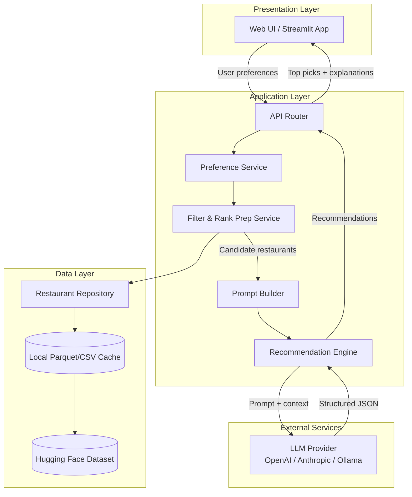
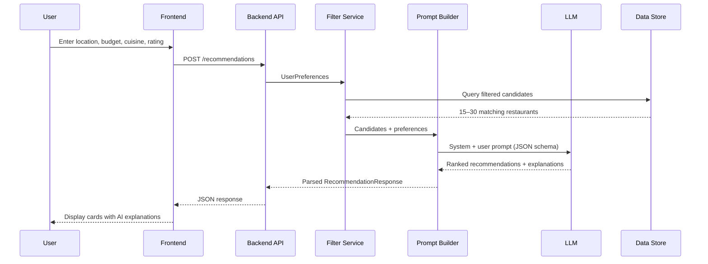
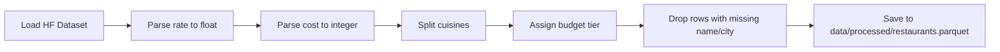

# Architecture: AI-Powered Restaurant Recommendation System

This document describes the technical architecture for building the Zomato-inspired restaurant recommendation service defined in [problemStatement.md](./problemStatement.md). The system combines structured filtering over a real-world dataset with LLM-based ranking and explanation generation.

---

## 1. Architecture Overview

### 1.1 Design Principles

| Principle | Description |
|-----------|-------------|
| **Hybrid intelligence** | Use deterministic filtering for hard constraints (location, rating, budget); use the LLM for ranking, nuance, and natural-language explanations. |
| **Separation of concerns** | Keep data ingestion, filtering, prompt construction, LLM calls, and UI in distinct modules. |
| **Cost & latency control** | Never send the full 51K-row dataset to the LLM. Pre-filter to a small candidate set (e.g., 15–30 restaurants). |
| **Structured I/O** | LLM responses must be parsed as JSON so the UI can render consistently. |
| **Local-first development** | Cache the dataset locally after first download; run without repeated Hugging Face pulls. |

### 1.2 High-Level System Diagram



### 1.3 Request Lifecycle



---

## 2. Technology Stack

### 2.1 Recommended Stack (Python-centric)

| Layer | Technology | Rationale |
|-------|------------|-----------|
| **Language** | Python 3.11+ | Strong ecosystem for data (`pandas`, `datasets`) and LLM SDKs |
| **Data loading** | `datasets` (Hugging Face), `pandas` | Native HF dataset support; easy preprocessing |
| **Backend** | FastAPI | Async, automatic OpenAPI docs, Pydantic validation |
| **Frontend (MVP)** | Streamlit | Fast to build; ideal for preference forms + result cards |
| **Frontend (production)** | React + Tailwind (optional upgrade) | Better UX if moving beyond MVP |
| **LLM** | OpenAI GPT-4o-mini / Anthropic Claude / Ollama (local) | Configurable via env vars |
| **Validation** | Pydantic v2 | Type-safe request/response models |
| **Config** | `python-dotenv` + `.env` | API keys and model selection |
| **Testing** | pytest | Unit tests for filters and prompt parsing |

### 2.2 Alternative: Full-Stack JavaScript

If the team prefers TypeScript:

- **Backend:** Node.js + Express or Next.js API routes
- **Data:** Pre-export dataset to Parquet/JSON at build time; load with `apache-arrow` or `duckdb`
- **LLM:** OpenAI SDK for Node
- **Frontend:** Next.js with shadcn/ui

---

## 3. Data Architecture

### 3.1 Source Dataset

- **Source:** [ManikaSaini/zomato-restaurant-recommendation](https://huggingface.co/datasets/ManikaSaini/zomato-restaurant-recommendation)
- **Size:** ~51,717 rows, ~574 MB
- **Split:** Single `train` split

### 3.2 Raw Schema Mapping

| Raw Column | Type | Usage in System |
|------------|------|-----------------|
| `name` | string | Display name; primary identifier |
| `location` | string (93 classes) | Filter by neighborhood/area |
| `listed_in(city)` | string (30 cities) | Filter by city (Delhi, Bangalore, etc.) |
| `cuisines` | string (comma-separated) | Filter by cuisine preference |
| `rate` | string (e.g., `"4.1/5"`, `"NEW"`, `"-"`) | Parse to float; filter by min rating |
| `approx_cost(for two people)` | string (e.g., `"300"`, `"1,200"`) | Parse to int; map to budget tier |
| `rest_type` | string | Optional filter (Casual Dining, Cafe, etc.) |
| `votes` | int | Tie-breaker for popularity |
| `online_order` | Yes/No | Optional preference filter |
| `book_table` | Yes/No | Optional preference filter |
| `dish_liked` | string | Enrich LLM context |
| `reviews_list` | string (long) | Sample/truncate for LLM context (optional) |
| `address` | string | Display in UI |
| `url` | string | Link to original listing |

### 3.3 Normalized Domain Model

After preprocessing, each restaurant is stored as:

```python
class Restaurant(BaseModel):
    id: str                          # hash of name + address
    name: str
    city: str                        # from listed_in(city)
    location: str                    # neighborhood
    cuisines: list[str]              # split from cuisines string
    rating: float | None             # parsed from rate
    cost_for_two: int | None         # parsed approx cost
    budget_tier: Literal["low", "medium", "high"]
    restaurant_type: str | None
    votes: int
    online_order: bool
    book_table: bool
    address: str
    url: str | None
    popular_dishes: list[str]        # from dish_liked
```

### 3.4 Preprocessing Pipeline



**Preprocessing rules:**

1. **Rating:** Strip `"X/5"` → `float`; treat `"NEW"`, `"-"`, empty as `None`.
2. **Cost:** Remove commas, cast to int; `None` if unparseable.
3. **Budget tiers** (configurable thresholds):
   - `low`: cost ≤ 500
   - `medium`: 501–1500
   - `high`: > 1500
4. **Cuisines:** Split on `,`, trim whitespace, lowercase for matching.
5. **City/location:** Normalize casing; build lookup indexes for dropdowns.

### 3.5 Local Storage & Indexing

```
data/
├── raw/                    # Downloaded HF snapshot
├── processed/
│   └── restaurants.parquet # Cleaned, typed dataset
└── metadata/
    ├── cities.json         # Unique cities for UI dropdown
    ├── locations.json      # Locations per city
    └── cuisines.json       # Unique cuisine tags
```

---

## 4. Application Layer

### 4.1 Module Structure

```
src/
├── main.py                     # FastAPI app entry point
├── config.py                   # Settings from env
├── models/
│   ├── preferences.py          # UserPreferences
│   ├── restaurant.py           # Restaurant domain model
│   └── recommendation.py       # RecommendationResponse
├── data/
│   ├── loader.py               # HF download + cache
│   ├── preprocessor.py         # Cleaning & normalization
│   └── repository.py           # Query/filter interface
├── services/
│   ├── filter_service.py       # Hard constraint filtering
│   ├── prompt_builder.py       # LLM prompt construction
│   └── recommendation_service.py  # Orchestrates filter → LLM → parse
├── llm/
│   ├── client.py               # Provider abstraction
│   └── schemas.py              # JSON schema for LLM output
└── api/
    └── routes/
        ├── recommendations.py  # POST /recommendations
        └── metadata.py         # GET /cities, /cuisines
```

### 4.2 Core Services

#### Filter Service

Applies **deterministic** filters before LLM involvement:

```python
class UserPreferences(BaseModel):
    city: str
    location: str | None = None
    budget: Literal["low", "medium", "high"] | None = None
    cuisines: list[str] = []
    min_rating: float | None = None
    online_order: bool | None = None
    book_table: bool | None = None
    additional_notes: str | None = None  # free-text for LLM
    top_k: int = 5
```

**Filter logic (in order):**

1. Match `city` (required)
2. Match `location` if provided (fuzzy or exact)
3. Match `budget_tier` if provided
4. Match any requested `cuisine` (substring match on normalized list)
5. `rating >= min_rating` if provided
6. Optional boolean flags (`online_order`, `book_table`)
7. Sort by `(rating DESC, votes DESC)`, take top **N = 25** candidates

If fewer than 5 candidates remain, relax constraints in order: location → cuisine → budget → min_rating, and log which constraints were relaxed.

#### Prompt Builder

Constructs a structured prompt with:
- System instructions (role, output format, constraints)
- Serialized user preferences
- Compact JSON array of candidate restaurants (only fields needed for ranking)

#### Recommendation Service (Orchestrator)

```python
async def get_recommendations(prefs: UserPreferences) -> RecommendationResponse:
    candidates = filter_service.filter(prefs, limit=25)
    if not candidates:
        return RecommendationResponse(recommendations=[], summary="No matches found.")
    prompt = prompt_builder.build(prefs, candidates)
    raw = await llm_client.complete(prompt)
    return parse_and_validate(raw, candidates)
```

---

## 5. LLM Integration

### 5.1 Provider Abstraction

```python
class LLMClient(Protocol):
    async def complete(self, messages: list[dict], *, response_format: dict | None) -> str: ...
```

Implementations:
- `OpenAIClient` — `gpt-4o-mini` with `response_format={"type": "json_object"}`
- `AnthropicClient` — Claude with structured output
- `OllamaClient` — Local models for offline dev

### 5.2 System Prompt & Response Schema

```python
class RankedRecommendation(BaseModel):
    restaurant_id: str
    rank: int
    explanation: str           # Why this fits the user

class RecommendationResponse(BaseModel):
    recommendations: list[RankedRecommendation]
    summary: str | None        # Optional overview of choices
    relaxed_constraints: list[str] = []  # If filters were loosened
```

---

## 6. API Design

### 6.1 Endpoints

| Method | Path | Description |
|--------|------|-------------|
| `GET` | `/health` | Health check |
| `GET` | `/metadata/cities` | List available cities |
| `GET` | `/metadata/locations?city={city}` | Locations for a city |
| `GET` | `/metadata/cuisines` | All cuisine tags |
| `POST` | `/recommendations` | Generate recommendations |

---

## 7. Frontend Architecture

### 7.1 Streamlit App (`frontend/app.py`)

- **Sidebar:** Dynamic form for preference selection (City, Location, Budget, Cuisine, Min Rating, Notes).
- **Main Area:** Structured recommendation cards with rank, ratings, costs, badges, Zomato URL links, and AI explanations.

---

## 8. Configuration & Environment Variables

```env
# LLM
LLM_PROVIDER=openai          # openai | anthropic | ollama
OPENAI_API_KEY=sk-...
OPENAI_MODEL=gpt-4o-mini

# Data
DATASET_NAME=ManikaSaini/zomato-restaurant-recommendation
DATA_CACHE_PATH=data/processed/restaurants.parquet

# App
API_HOST=0.0.0.0
API_PORT=8000
CORS_ORIGINS=http://localhost:8501

# Filter defaults
MAX_CANDIDATES_FOR_LLM=25
DEFAULT_TOP_K=5
```

---

## 9. Implementation Phases

1. **Phase 0:** Project Setup & Repo Skeleton
2. **Phase 1:** Data Ingestion & Preprocessing Pipeline
3. **Phase 2:** Deterministic Filter Service & Backend API
4. **Phase 3:** LLM Recommendation Engine Integration
5. **Phase 4:** Streamlit UI Development
6. **Phase 5:** Testing, Containerization & Final Polish
