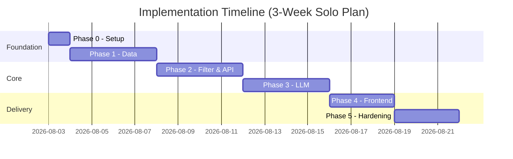
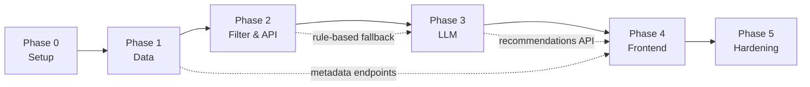

# Phase-Wise Implementation Plan

This document is the execution roadmap for building the AI-powered restaurant recommendation system described in [problemStatement.md](./problemStatement.md) and [architecture.md](./architecture.md).

**Stack:** Python 3.11+, FastAPI, Streamlit, Hugging Face `datasets`, Pydantic v2, OpenAI/Ollama  
**Estimated duration:** 3 weeks (solo developer) · 2 weeks (pair/small team)  
**Goal:** Deliver an end-to-end MVP that ingests real Zomato data, accepts user preferences, ranks restaurants via LLM, and displays personalized recommendations.

---

## Plan at a Glance

| Phase | Name | Problem-Statement Stage | Duration | Outcome |
|-------|------|-------------------------|----------|---------|
| **0** | Project Setup | — | 1 day | Runnable repo skeleton |
| **1** | Data Foundation | Data Ingestion | 3–4 days | Clean dataset + metadata APIs |
| **2** | Filter & Core API | User Input + Integration (partial) | 3–4 days | Rule-based recommendations API |
| **3** | LLM Integration | Integration Layer + Recommendation Engine | 3–4 days | AI-ranked results with explanations |
| **4** | Frontend | User Input + Output Display | 2–3 days | Streamlit UI wired to API |
| **5** | Hardening & Delivery | All stages (production-ready) | 2–3 days | Tested, containerized, documented MVP |



---

## Cross-Phase Dependency Map



---

## Phase 0 — Project Setup

**Objective:** Establish the repository, dependencies, and development workflow so all later phases can proceed without rework.

### Tasks

| # | Task | Details |
|---|------|---------|
| 0.1 | Initialize project structure | Create folders per [architecture.md §4.1](./architecture.md#41-module-structure) |
| 0.2 | Add dependency files | `requirements.txt` or `pyproject.toml` with pinned core deps |
| 0.3 | Configure environment | `.env.example`, `src/config.py` using `pydantic-settings` |
| 0.4 | Scaffold FastAPI app | `src/main.py` with `/health` endpoint and CORS |
| 0.5 | Set up testing | `pytest` config, `tests/conftest.py`, CI-ready test command |
| 0.6 | Add tooling | `ruff` for lint/format |
| 0.7 | Write README stub | Setup instructions, env vars, how to run |

### Files to Create

```
src/main.py
src/config.py
requirements.txt
.env.example
tests/conftest.py
README.md (stub)
.gitignore
```

### Acceptance Criteria

- [ ] `uvicorn src.main:app --reload` starts without errors
- [ ] `GET /health` returns `{"status": "ok"}`
- [ ] `pytest` runs cleanly
- [ ] `.env.example` documents all required variables

---

## Phase 1 — Data Foundation

**Objective:** Implement **Data Ingestion** from the problem statement — load, preprocess, cache, and expose the Zomato dataset.

**Maps to:** Problem Statement → *Data Ingestion*

### Tasks

| # | Task | Details |
|---|------|---------|
| 1.1 | Dataset loader | Download from [ManikaSaini/zomato-restaurant-recommendation](https://huggingface.co/datasets/ManikaSaini/zomato-restaurant-recommendation) via `datasets` library |
| 1.2 | Preprocessor | Parse `rate`, `approx_cost(for two people)`, split `cuisines`, assign budget tiers |
| 1.3 | Domain models | `Restaurant` Pydantic model in `src/models/restaurant.py` |
| 1.4 | ID generation | Hash `name + address` for stable `restaurant.id` |
| 1.5 | Parquet cache | Save to `data/processed/restaurants.parquet` (run once, reuse locally) |
| 1.6 | Metadata export | Generate `data/metadata/cities.json`, `locations.json`, `cuisines.json` |
| 1.7 | Repository | `RestaurantRepository` with in-memory city index on startup |
| 1.8 | Metadata API | `GET /metadata/cities`, `/metadata/locations?city=`, `/metadata/cuisines` |
| 1.9 | Preprocess script | `scripts/preprocess_dataset.py` for one-off CLI run |
| 1.10 | Unit tests | Tests for rating/cost parsing, budget tier assignment |

### Preprocessing Rules

| Field | Raw Example | Normalized |
|-------|-------------|------------|
| `rate` | `"4.1/5"` | `4.1` |
| `rate` | `"NEW"`, `"-"` | `None` |
| `approx_cost(for two people)` | `"1,200"` | `1200` |
| Budget tier | cost ≤ 500 | `"low"` |
| Budget tier | 501–1500 | `"medium"` |
| Budget tier | > 1500 | `"high"` |
| `cuisines` | `"North Indian, Chinese"` | `["north indian", "chinese"]` |

### Files to Create

```
src/models/restaurant.py
src/data/loader.py
src/data/preprocessor.py
src/data/repository.py
src/api/routes/metadata.py
scripts/preprocess_dataset.py
tests/test_preprocessor.py
data/processed/restaurants.parquet   (generated)
data/metadata/cities.json            (generated)
data/metadata/locations.json         (generated)
data/metadata/cuisines.json          (generated)
```

---

## Phase 2 — Filter Service & Core API

**Objective:** Implement **User Input** validation and the deterministic half of the **Integration Layer** — filter restaurants before any LLM call.

**Maps to:** Problem Statement → *User Input*, *Integration Layer (filtering)*

### Tasks

| # | Task | Details |
|---|------|---------|
| 2.1 | Preference model | `UserPreferences` in `src/models/preferences.py` |
| 2.2 | Filter service | `FilterService` with ordered constraint application |
| 2.3 | Constraint relaxation | Relax location → cuisine → budget → min_rating if < 5 matches |
| 2.4 | Candidate limit | Return top 25 by `(rating DESC, votes DESC)` |
| 2.5 | Recommendation model | `RecommendationResponse` structure |
| 2.6 | Rule-based endpoint | `POST /recommendations` returning rating-sorted top-K |
| 2.7 | Input validation | Reject unknown cities; validate budget enum and rating range |
| 2.8 | Error responses | 400/422/503 per architecture spec |
| 2.9 | Unit & API tests | Filter combinations, relaxation logic, TestClient route tests |

### Files to Create

```
src/models/preferences.py
src/models/recommendation.py
src/services/filter_service.py
src/api/routes/recommendations.py
tests/test_filter_service.py
tests/test_recommendation_api.py
```

---

## Phase 3 — LLM Integration

**Objective:** Complete the **Integration Layer** (prompt design) and **Recommendation Engine** — LLM ranking, explanations, and optional summary.

**Maps to:** Problem Statement → *Integration Layer*, *Recommendation Engine*

### Tasks

| # | Task | Details |
|---|------|---------|
| 3.1 | LLM client protocol | Abstract interface in `src/llm/client.py` |
| 3.2 | OpenAI implementation | `gpt-4o-mini` with JSON response format |
| 3.3 | Ollama implementation | Local fallback for dev without API key |
| 3.4 | Prompt builder | System + user messages with compact candidate JSON |
| 3.5 | Output schema | `RankedRecommendation` with `restaurant_id`, `rank`, `explanation` |
| 3.6 | Response parser | Validate JSON; map IDs back to full `Restaurant` objects |
| 3.7 | Hallucination guard | Reject recommendations whose IDs are not in candidate set |
| 3.8 | Retry & fallback | Retry once on parse failure; fallback to rule-based ranking |
| 3.9 | Recommendation service | Orchestrate filter → prompt → LLM → parse |
| 3.10 | Wire into API | Upgrade `POST /recommendations` to use LLM path |
| 3.11 | Tests | Mock LLM fixture; parser tests; integration test |

### Files to Create

```
src/llm/client.py
src/llm/schemas.py
src/services/prompt_builder.py
src/services/recommendation_service.py
tests/test_prompt_builder.py
tests/test_llm_parser.py
tests/fixtures/mock_llm_response.json
```

---

## Phase 4 — Frontend (Streamlit UI)

**Objective:** Implement **User Input** collection and **Output Display** — a user-friendly interface for preferences and AI recommendations.

**Maps to:** Problem Statement → *User Input*, *Output Display*

### Tasks

| # | Task | Details |
|---|------|---------|
| 4.1 | Streamlit app scaffold | `frontend/app.py` with page config and layout |
| 4.2 | API client | `httpx`-based helper targeting FastAPI base URL |
| 4.3 | Preference form (sidebar) | City, location, budget, cuisine, rating, notes |
| 4.4 | Dynamic dropdowns | Load cities/locations/cuisines from metadata endpoints |
| 4.5 | Submit handler | POST to `/recommendations` on button click |
| 4.6 | Loading state | Spinner during LLM call (2–10s) |
| 4.7 | Results panel | Summary banner + recommendation cards |
| 4.8 | Card content | Name, cuisine, rating, cost, AI explanation, Zomato link |
| 4.9 | Empty & error states | No matches, API down, validation errors |

### Files to Create

```
frontend/app.py
frontend/api_client.py
```

---

## Phase 5 — Hardening & Delivery

**Objective:** Make the MVP reliable, reproducible, and demo-ready across all five problem-statement workflow stages.

### Tasks

| # | Task | Details |
|---|------|---------|
| 5.1 | Complete README | Setup, env vars, preprocess step, run instructions |
| 5.2 | Dockerize API | `Dockerfile` for FastAPI service |
| 5.3 | Docker Compose | `api` + `frontend` services with shared volume for data |
| 5.4 | `.env.example` | Finalize all variables with comments |
| 5.5 | Structured logging | Log filter counts, LLM latency, errors |
| 5.6 | Integration test suite | Full flow with mocked LLM |
| 5.7 | E2E smoke test | Documented manual checklist & demo queries |

### Files to Create / Finalize

```
Dockerfile
docker-compose.yml
README.md
.env.example
```

---

## Phase 6 — Advanced Web UI (Stitch "Lumina Noir" Integration)

**Objective:** Transform the application's visual experience into a premium, glassmorphic Single Page Application (SPA) based on Google Stitch `docs/stitch/code.html` and `docs/stitch/DESIGN.md`.

### Tasks

| # | Task | Details |
|---|------|---------|
| 6.1 | Single Page Web App Scaffold | Create `src/static/index.html` based on Google Stitch "Lumina Noir" design system |
| 6.2 | Frontend Client JavaScript | `src/static/app.js` handling dynamic metadata loading (`/metadata/*`) & recommendation API POSTs |
| 6.3 | FastAPI Static Route | Mount `/static` directory and serve `index.html` on `GET /` |
| 6.4 | Dynamic UI Form Controls | City, location, cuisine tag selection, budget chips, min rating slider, and AI free-text prompt box |
| 6.5 | Dynamic Recommendation Cards | Gold rank badges, rating chips, cost for two, popular dish tags, AI recommendation insights, Zomato outbound links |
| 6.6 | UI Route Tests | `tests/test_ui.py` testing static files serving and `GET /` endpoint |

### Files to Create / Finalize

```
src/static/index.html
src/static/app.js
tests/test_ui.py
```

---

## Master Progress Tracker

### Phase 0 — Setup
- [x] Project structure created
- [x] FastAPI `/health` running
- [x] pytest configured

### Phase 1 — Data Foundation
- [x] Hugging Face dataset downloaded and preprocessed
- [x] Parquet cache generated
- [x] Metadata JSON files generated
- [x] Metadata API endpoints live
- [x] Preprocessor tests passing

### Phase 2 — Filter & Core API
- [x] `UserPreferences` model defined
- [x] `FilterService` with relaxation logic
- [x] Rule-based `POST /recommendations` working
- [x] Filter and API tests passing

### Phase 3 — LLM Integration
- [x] LLM client abstraction implemented
- [x] Prompt builder producing valid prompts
- [x] JSON parsing + hallucination guard
- [x] AI explanations in API response

### Phase 4 — Frontend
- [x] Streamlit preference form complete
- [x] Dynamic metadata dropdowns
- [x] Recommendation cards with all required fields

### Phase 5 — Delivery
- [x] README complete
- [x] Docker Compose working
- [x] All tests passing
- [x] Demo scenarios documented

### Phase 6 — Advanced Web UI (Stitch Integration)
- [x] Lumina Noir SPA scaffold created
- [x] Dynamic JavaScript client wired to API endpoints
- [x] FastAPI HTML serving & static files mounted
- [x] UI tests passing
